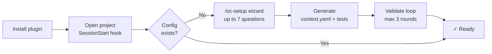
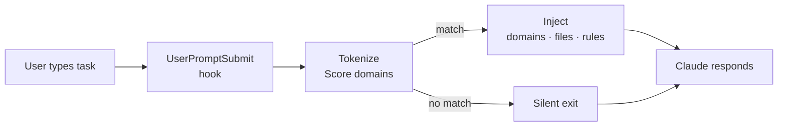

<p align="center">
  
</p>

<p align="center">
  Zero-LLM context routing for AI agents — hooks into every prompt,<br>
  injects only the relevant domain, files, and architecture rules.
</p>

<p align="center">
  <a href="https://github.com/oopsla5xx/open-context/releases"></a>
  <a href="./LICENSE"></a>
  
  
</p>

<p align="center">
  <a href="./README.vi.md">Tiếng Việt</a> · <strong>English</strong>
</p>

---

AI agents on large codebases default to loading everything — full `CLAUDE.md`, docs for every domain, models that don't apply. The context window fills; precision drops. The fix isn't a smarter agent. It's a better signal going in.

Open:Context is a Claude Code plugin that fires a `UserPromptSubmit` hook on every prompt. It tokenizes the task, scores it against your `context.yaml`, and injects only the matching domain: component chain, relevant files, and applicable architecture rules. If nothing matches, it exits silently. Fully deterministic — no LLM in the routing path.

---

## What it looks like

You type a task. Before Claude responds, the hook has already resolved and injected:

```
[you type]  implement password reset for patron

[injected]  ────────────────────────────────────────────────────────────
            TASK   : implement password reset for patron
            ACTION : create
            ────────────────────────────────────────────────────────────

            [MATCHED DOMAINS]
              member_management   score=2  keywords=['patron']

            [COMPONENTS]
              ▸ CONTROLLER  — instantiates one Operation, renders via Serializer
              ▸ OPERATION   — step_* structure, Form.valid! before any write
              ▸ FORM        — ApplicationForm, validate only, no side-effects
              ▸ MODEL       — AR persistence
              ▸ SERIALIZER  — JSON in Controller, never in Operation

            [RULES]  (4 applicable)
              [CRITICAL] rule-01-no-business-logic-in-controller
              [CRITICAL] rule-02-one-operation-per-action
              [CRITICAL] rule-03-step-method-structure
              [CRITICAL] rule-04-validate-before-mutate

            [FILES]  (3 entries)
              app/controllers/v1/librarians/members_controller.rb
              app/operations/v1/librarians/members/create_operation.rb
              app/models/member.rb
```

After each matched prompt, Claude Code shows a system notice with token savings:

```
[open-context] 91% token reduction (1.2 KB injected vs 14.8 KB full context)
```

Task matches no domain (e.g. "explain this error") → hook exits silently, nothing injected, no notice shown.

---

## Install

```bash
/plugin marketplace add oopsla5xx/open-context
/plugin install open-context@open-context
```

First time you open a project after install, the plugin detects that no configuration exists and starts the setup wizard automatically — asks up to 7 questions (scope, communication language, programming language, framework, architecture pattern, actor roles, and optionally CI setup), then generates `context.yaml`, test phrasing files, validates everything in one agentic loop, and optionally writes a GitHub Actions workflow. Nothing to run manually.

If the wizard doesn't start on its own (e.g. you're continuing in an existing session rather than a fresh one), run `/oc-setup` yourself at any time — it works standalone, independent of the hook.

**Uninstall:**

```bash
/plugin uninstall open-context@open-context
/plugin marketplace remove open-context
```

**Update to latest version:**

```bash
/plugin update open-context@open-context
```

**CI or other agents (optional):**

```bash
pip install git+https://github.com/oopsla5xx/open-context.git
# phrasing coverage + amplification + file-existence check
open-context validate --context path/to/context.yaml --tests path/to/tests/ --repo . --strict
# architecture rules
open-context architecture validate --repo .
```

`--strict` exits 1 when any declared path is missing or phrasing coverage is below 80% (MEDIUM/HIGH risk). Omit for local runs where you want warnings without a hard failure.

---

## How it works

**First run — setup once per project:**



**Every prompt — automatic routing:**



`context.yaml` is generated by `/oc-setup` or `/oc-init` — or written by hand, see [`examples/rails-hmvc-sample/`](examples/rails-hmvc-sample/). PyYAML is vendored, so the hook needs no `pip install`. Full schema in [`docs/reference.md`](docs/reference.md#contextyaml).

---

## Skills

| Skill | What it does |
|-------|--------------|
| `/oc-setup` | First-run wizard — pre-fills answers from automated discovery, generates `context.yaml` + tests, validates routing, re-runnable any time |
| `/oc-init` | Regenerate `context.yaml` from existing settings + a scan of docs and source |
| `/oc-resolve <task>` | Debug routing — full resolver output, including domains below threshold |
| `/oc-validate` | Phrasing coverage + amplification safety check across `context.yaml` |
| `/oc-validate-architecture` | Static scan of 6 HMVC compliance rules (R1–R6) on Rails code |

---

## Learn more

- [`docs/reference.md`](docs/reference.md) — automated discovery detail, `context.yaml` schema, architecture validator rules, limitations, known unmeasured caveats
- [`docs/open-context-v0-architecture.md`](docs/open-context-v0-architecture.md) — benchmark methodology
- [`examples/rails-hmvc-sample/`](examples/rails-hmvc-sample/) — working 3-domain reference project

---

## License

Apache 2.0 — see [LICENSE](LICENSE).
PyYAML (vendored in `vendor/yaml/`) is MIT — see [`vendor/PYYAML_LICENSE`](vendor/PYYAML_LICENSE).
