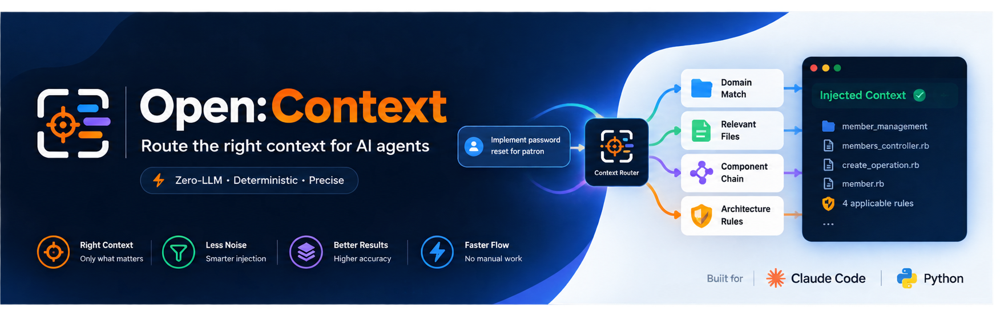
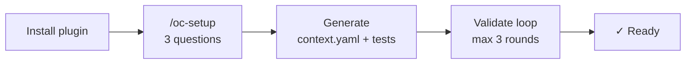
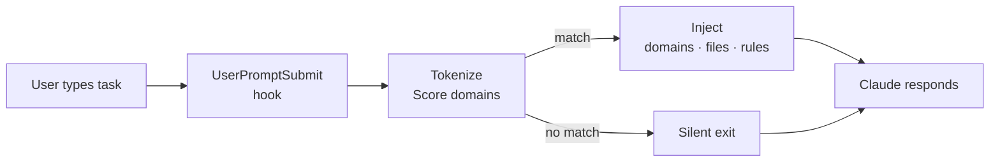

<p align="center">
  
</p>

<p align="center">
  Zero-LLM context routing for AI agents — hooks into every prompt,<br>
  injects only the relevant domain, files, and architecture rules.
</p>

<p align="center">
  <a href="https://github.com/oopsla5xx/open-context/releases"></a>
  <a href="./LICENSE"></a>
  
  
</p>

<p align="center">
  
  
  
  
  
  
</p>

<p align="center">
  Any repo, any architecture — docs-first project profiling, no framework-specific detector required.
</p>

<p align="center">
  <a href="./README.vi.md">Tiếng Việt</a> · <strong>English</strong>
</p>

---

AI agents on large codebases default to loading everything — full `CLAUDE.md`, docs for every domain, models that don't apply. The context window fills; precision drops. The fix isn't a smarter agent. It's a better signal going in.

Open:Context is a Claude Code plugin that fires a `UserPromptSubmit` hook on every prompt. It tokenizes the task, scores it against your `context.yaml`, and injects only the matching domain: component chain, relevant files, and applicable architecture rules. If nothing matches, it exits silently. Fully deterministic — no LLM in the routing path.

---

## What it looks like

You type a task. Before Claude responds, the hook has already resolved and injected:

```
[you type]  implement password reset for patron

[injected]  ────────────────────────────────────────────────────────────
            TASK   : implement password reset for patron
            ACTION : create
            ────────────────────────────────────────────────────────────

            [MATCHED DOMAINS]
              member_management   score=2  keywords=['patron']

            [COMPONENTS]
              ▸ CONTROLLER  — instantiates one Operation, renders via Serializer
              ▸ OPERATION   — step_* structure, Form.valid! before any write
              ▸ FORM        — ApplicationForm, validate only, no side-effects
              ▸ MODEL       — AR persistence
              ▸ SERIALIZER  — JSON in Controller, never in Operation

            [RULES]  (4 applicable)
              [CRITICAL] rule-01-no-business-logic-in-controller
              [CRITICAL] rule-02-one-operation-per-action
              [CRITICAL] rule-03-step-method-structure
              [CRITICAL] rule-04-validate-before-mutate

            [FILES]  (3 entries)
              app/controllers/v1/librarians/members_controller.rb
              app/operations/v1/librarians/members/create_operation.rb
              app/models/member.rb
```

After each matched prompt, Claude Code shows a system notice with token savings:

```
[open-context] 91% token reduction (1.2 KB injected vs 14.8 KB full context)
```

Task matches no domain (e.g. "explain this error") → hook exits silently, nothing injected, no notice shown.

---

## Install

```bash
/plugin marketplace add oopsla5xx/open-context
/plugin install open-context@open-context
```

**Uninstall:**

```bash
/plugin uninstall open-context@open-context
/plugin marketplace remove open-context
```

**Update to latest version:**

```bash
claude plugin update open-context@open-context
```

Run this from your terminal, not as a slash command inside Claude Code — `/plugin update` doesn't exist. Restart Claude Code afterward to load the new version.

---

## Setup

```bash
/oc-setup
```

Asks 3 questions — scope, communication language, and one project-profile confirm — then generates `context.yaml` and test phrasing files under `.open-context/`, validates everything in one agentic loop. Re-run any time to reconfigure.

`.open-context/` is **local to your machine and gitignored** (the wizard adds the entry itself) — routing config is per-developer, not shared with the team via git. Each teammate who wants routing runs `/oc-setup` themselves.

The project-profile question is docs-first: it reads your repo's own `README.md`/`CLAUDE.md`/`AGENTS.md`/`docs/**/*.md` (found by a deterministic scan, `open-context discover-docs`) to synthesize language/framework/architecture/actors, citing which file each field came from. No docs? It falls back to reading your source code directly, the way a new engineer would — works for any language or framework, not just the ones with a structured-manifest detector. Stack auto-detect (`open-context detect`) additionally covers Ruby/Node/Python/Go/Rust/Java manifests as a near-certain cross-check. Details in [`docs/reference.md`](docs/reference.md#automated-discovery).

---

## How it works

**First run — setup once per project:**



**Every prompt — automatic routing:**



`context.yaml` is generated under `.open-context/` by `/oc-setup` or `/oc-init` — or written by hand anywhere the hook looks (see [`examples/`](examples/) for committed reference projects, including one with no layered architecture at all). PyYAML is vendored, so the hook needs no `pip install`. Full schema in [`docs/reference.md`](docs/reference.md#contextyaml).

---

## Skills

| Skill | What it does |
|-------|--------------|
| `/oc-setup` | First-run wizard — pre-fills answers from automated discovery, generates `context.yaml` + tests, validates routing, re-runnable any time |
| `/oc-init` | Regenerate `context.yaml` from existing settings + a scan of docs and source |
| `/oc-resolve <task>` | Debug routing — full resolver output, including domains below threshold |
| `/oc-validate` | Phrasing coverage + amplification safety check across `context.yaml` |

---

## Learn more

- [`docs/reference.md`](docs/reference.md) — automated discovery detail, `context.yaml` schema, limitations, known unmeasured caveats
- [`docs/open-context-v0-architecture.md`](docs/open-context-v0-architecture.md) — benchmark methodology
- [`examples/rails-hmvc-sample/`](examples/rails-hmvc-sample/) — working reference project, layered HMVC architecture
- [`examples/nextjs-sample/`](examples/nextjs-sample/) — working reference project, Next.js Server Actions
- [`examples/data-pipeline-sample/`](examples/data-pipeline-sample/) — working reference project with **no** `architecture.flow` — standalone scripts, no layers

---

## License

Apache 2.0 — see [LICENSE](LICENSE).
PyYAML (vendored in `vendor/yaml/`) is MIT — see [`vendor/PYYAML_LICENSE`](vendor/PYYAML_LICENSE).
