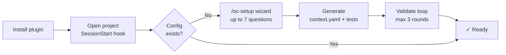
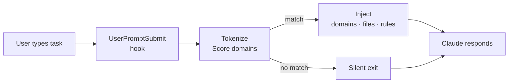

<p align="center">
  
</p>

<p align="center">
  Zero-LLM context routing for AI agents — hooks into every prompt,<br>
  injects only the relevant domain, files, and architecture rules.
</p>

<p align="center">
  <a href="https://github.com/oopsla5xx/open-context/releases"></a>
  <a href="./LICENSE"></a>
  
  
</p>

<p align="center">
  <a href="./README.vi.md">Tiếng Việt</a> · <strong>English</strong>
</p>

---

AI agents on large codebases default to loading everything — full `CLAUDE.md`, docs for every domain, models that don't apply. The context window fills; precision drops. The fix isn't a smarter agent. It's a better signal going in.

Open:Context is a Claude Code plugin that fires a `UserPromptSubmit` hook on every prompt. It tokenizes the task, scores it against your `context.yaml`, and injects only the matching domain: component chain, relevant files, and applicable architecture rules. If nothing matches, it exits silently. Fully deterministic — no LLM in the routing path.

---

## What it looks like

You type a task. Before Claude responds, the hook has already resolved and injected:

```
[you type]  implement password reset for patron

[injected]  ────────────────────────────────────────────────────────────
            TASK   : implement password reset for patron
            ACTION : create
            ────────────────────────────────────────────────────────────

            [MATCHED DOMAINS]
              member_management   score=2  keywords=['patron']

            [COMPONENTS]
              ▸ CONTROLLER  — instantiates one Operation, renders via Serializer
              ▸ OPERATION   — step_* structure, Form.valid! before any write
              ▸ FORM        — ApplicationForm, validate only, no side-effects
              ▸ MODEL       — AR persistence
              ▸ SERIALIZER  — JSON in Controller, never in Operation

            [RULES]  (4 applicable)
              [CRITICAL] rule-01-no-business-logic-in-controller
              [CRITICAL] rule-02-one-operation-per-action
              [CRITICAL] rule-03-step-method-structure
              [CRITICAL] rule-04-validate-before-mutate

            [FILES]  (3 entries)
              app/controllers/v1/librarians/members_controller.rb
              app/operations/v1/librarians/members/create_operation.rb
              app/models/member.rb
```

After each matched prompt, Claude Code shows a system notice with token savings:

```
[open-context] 91% token reduction (1.2 KB injected vs 14.8 KB full context)
```

Task matches no domain (e.g. "explain this error") → hook exits silently, nothing injected, no notice shown.

---

## Install

```bash
/plugin marketplace add oopsla5xx/open-context
/plugin install open-context@open-context
```

First time you open a project after install, the plugin detects that no configuration exists and starts the setup wizard automatically — asks up to 7 questions (scope, communication language, programming language, framework, architecture pattern, actor roles, and optionally CI setup), then generates `context.yaml`, test phrasing files, validates everything in one agentic loop, and optionally writes a GitHub Actions workflow. Nothing to run manually.

**Uninstall:**

```bash
/plugin uninstall open-context@open-context
/plugin marketplace remove open-context
```

**Reinstall from scratch:**

```bash
/plugin marketplace add oopsla5xx/open-context
/plugin install open-context@open-context
```

**Update to latest version:**

```bash
/plugin update open-context@open-context
```

> [!IMPORTANT]
> All benchmark numbers referenced in `docs/open-context-v0-architecture.md` (context reduction, architecture compliance, implementation quality) were measured against a **hand-written** Context Model. `/oc-setup`'s generated output passes automated routing validation, but its domain/pattern/constraint *content* has not been separately benchmarked against hand-written equivalents — especially for security-sensitive scoping rules. Review generated files before relying on them in production.

**CI or other agents (optional):**

```bash
pip install git+https://github.com/oopsla5xx/open-context.git
# phrasing coverage + amplification + file-existence check
open-context validate --context path/to/context.yaml --tests path/to/tests/ --repo . --strict
# architecture rules
open-context architecture validate --repo .
# stack detection (Ruby/Node/Python) — see "Automated discovery" below
open-context detect --repo .
# architecture discovery (Rails-family apps) — see "Automated discovery" below
open-context architecture discover --repo .
```

`--strict` exits 1 when any declared path is missing or phrasing coverage is below 80% (MEDIUM/HIGH risk). Omit for local runs where you want warnings without a hard failure.

---

## How it works

**First run — setup once per project:**



**Every prompt — automatic routing:**



`context.yaml` is generated by `/oc-setup` or `/oc-init`. You can also write it by hand — see `examples/rails-hmvc-sample/` for a working 3-domain reference. PyYAML is vendored — no `pip install` needed for the hook.

---

## Skills

| Skill | What it does |
|-------|--------------|
| `/oc-setup` | Runs automated discovery first (see below) to pre-fill answers with real evidence, then asks up to 7 questions → generates `context.yaml` + test files → validates *routing* in an agentic loop (patch → retest → ask → repeat up to 3 rounds) → optionally writes a GitHub Actions CI workflow. Routing validation confirms phrasings route correctly — it does not verify that generated patterns/constraints are accurate or complete. Review the output before relying on it for production work. Re-run any time to reconfigure (asks before overwriting an existing `context.yaml`/settings file). |
| `/oc-init` | Regenerate `context.yaml` for the current project — reads existing settings, scans docs and source code, validates automatically |
| `/oc-resolve <task>` | Debug routing — full resolver output including domains that scored below threshold |
| `/oc-validate` | Phrasing coverage tests + amplification safety check across `context.yaml` |
| `/oc-validate-architecture` | Static scan of 6 HMVC compliance rules (R1–R6) across the Rails codebase |

---

## Automated discovery

`/oc-setup` doesn't start blind. Before asking anything, it runs two deterministic detectors and pre-fills the relevant questions — you still confirm every answer; nothing is written to `context.yaml` without an explicit yes.

**Stack detection** — Ruby (`Gemfile`), Node (`package.json`), Python (`pyproject.toml`/`requirements.txt`) only, this round. Reads structured config first; falls back to `CLAUDE.md`/`README.md` prose only for fields a manifest can't answer (e.g. a database's server version), at visibly lower confidence. Near-certain fields are shown as one batch-confirm line — press Enter to accept, or correct just the field that's wrong:

```
Detected: Ruby 3.2.1 · Rails 7.0.4.2 · Bundler · PostgreSQL · ActiveRecord · RSpec
Press Enter to use this, or type corrections.
```

**Architecture discovery** — Rails-family apps only, this round. Scans `app/` for the components that actually exist and the call-evidence between them — never a fixed HMVC template, since a real app can turn out to be `admin → operation → form → model` with no serializer at all. Presented as a proposal, not a decision:

```
Detected component chain (from real call-evidence in app/, not a template):
admin → operations → forms → models
Based on 11 discovered components, 11 call-evidence edges, no cycle detected.

1. Yes — use this chain as-is
2. Review — see the full per-edge evidence before deciding
3. Select another — pick from the standard patterns
4. Custom — describe your own component chain
```

If the evidence is too weak or tangled to trust — no call-evidence at all, or a cycle covering most of the connected components — it skips the proposal and asks directly instead of guessing. Both detectors run standalone too:

```bash
open-context detect --repo .
open-context architecture discover --repo .
```

---

## context.yaml

Four layers, one file per project:

```
L1  STACK        — language, framework, API mode
L2  ARCHITECTURE — component chain and per-component responsibilities
L3  DOMAINS      — keywords, related files, subtypes, patterns per domain
L4  INVARIANTS   — always-applicable architecture rules with severity and guidance
```

Each domain declares a coverage level:

| Level | When |
|-------|------|
| `routing_only` | Standard CRUD — naming convention is enough |
| `file_indexed` | Non-obvious paths, shared infra, concurrency |
| `pattern_indexed` | Subtle invariants needing explicit guidance |

Working example with all coverage levels: [`examples/rails-hmvc-sample/`](examples/rails-hmvc-sample/).

> [!IMPORTANT]
> A stale `context.yaml` produces no error — it routes silently to the wrong files. Version it alongside the code it describes. Treat `/oc-validate` failures as CI failures.

---

## Architecture validator (R1–R6)

Static analysis for Rails HMVC codebases — six violation categories:

| Rule | Detects |
|------|---------|
| R1 | AR queries or `raise` inside controller action methods |
| R2 | `Form.new()` not followed by `.valid!` |
| R3 | `Form.new(params)` instead of `permit_params` |
| R4 | `render json:` instead of `render_json()` |
| R5 | Unscoped `Model.find(params[:id])` on tenant-scoped resources |
| R6 | Bare `raise "string"` instead of a custom exception class |

Runs grep across the real codebase — use for compliance audits, not routine checks.

---

## Limitations

**Keyword ceiling.** Tasks phrased with synonyms or colloquial language may score below threshold and inject nothing. Run `/oc-validate` regularly to catch phrasing gaps.

**Architecture rules are fixed.** The 6 HMVC rules fit one project's conventions. Different naming or exception hierarchies require adjusting allowlists in `validator.py`.

---

## Known unmeasured

**Hook latency on non-SSD setups.** Fires on every prompt: filesystem traversal + resolver execution. Estimated < 5 ms on local SSD. On NFS mounts, Docker volumes, or WSL2 cross-filesystem paths (`/mnt/c/...`), latency is higher and has not been measured.

**Truncation at large scale.** Output cuts at the last section boundary before 9,500 characters. Synthetic benchmarks (15 domains, 12 rules, 3 simultaneous matches) produce ~9,700 characters — near the limit. At 20+ domains, truncation may become frequent. A compact output mode is the planned mitigation.

**Auto-generated `context.yaml` quality.** `/oc-setup` and `/oc-init` generate `context.yaml` via an LLM-driven wizard, validated automatically for routing correctness only. Whether generated patterns/constraints match the accuracy of hand-written equivalents — the property measured in `docs/open-context-v0-architecture.md` — has not been tested.

**Discovery detector scope.** Stack detection covers Ruby/Node/Python only (verified against 4 real repos); other languages listed in early design notes (Go, Java, Rust) have no detector yet. Architecture discovery covers Rails-family apps only (verified against 2 real repos, one clean and one with a real cyclic dependency) — Next.js/other patterns are not implemented. Both were deliberately scoped to what has real ground truth to verify against, not the full original wishlist.

---

## License

Apache 2.0 — see [LICENSE](LICENSE).
PyYAML (vendored in `vendor/yaml/`) is MIT — see [`vendor/PYYAML_LICENSE`](vendor/PYYAML_LICENSE).
