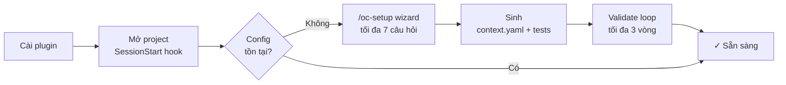
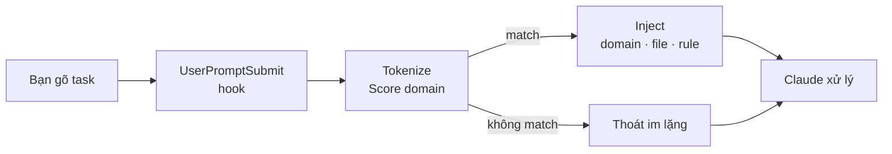

<p align="center">
  
</p>

<p align="center">
  <strong>Open:Context</strong>
</p>

<p align="center">
  Routing context zero-LLM cho AI agent — hook vào mọi prompt,<br>
  chỉ inject đúng domain, file, và architecture rule liên quan.
</p>

<p align="center">
  <a href="https://github.com/oopsla5xx/open-context/releases"></a>
  <a href="./LICENSE"></a>
  
  
</p>

<p align="center">
  <strong>Tiếng Việt</strong> · <a href="./README.md">English</a>
</p>

---

AI agent trên codebase lớn thường mặc định load hết — toàn bộ `CLAUDE.md`, docs của mọi domain, model không liên quan. Context window đầy nhanh, độ chính xác giảm. Vấn đề không phải agent chưa đủ thông minh — mà là signal đầu vào quá nhiễu.

Open:Context là Claude Code plugin hook vào mọi prompt qua `UserPromptSubmit`. Nó tokenize task, score theo `context.yaml`, và chỉ inject đúng phần match: component chain, file liên quan, và architecture rule áp dụng. Nếu không có gì match, hook thoát im lặng. Hoàn toàn deterministic — không có LLM nào trong routing path.

---

## Kết quả trông như thế nào

Bạn gõ task. Trước khi Claude xử lý, hook đã resolve và inject xong:

```
[bạn gõ]   implement password reset for patron

[injected]  ────────────────────────────────────────────────────────────
            TASK   : implement password reset for patron
            ACTION : create
            ────────────────────────────────────────────────────────────

            [MATCHED DOMAINS]
              member_management   score=2  keywords=['patron']

            [COMPONENTS]
              ▸ CONTROLLER  — instantiates one Operation, renders via Serializer
              ▸ OPERATION   — step_* structure, Form.valid! trước mọi write
              ▸ FORM        — ApplicationForm, chỉ validate, không side-effect
              ▸ MODEL       — AR persistence
              ▸ SERIALIZER  — JSON trong Controller, không trong Operation

            [RULES]  (4 applicable)
              [CRITICAL] rule-01-no-business-logic-in-controller
              [CRITICAL] rule-02-one-operation-per-action
              [CRITICAL] rule-03-step-method-structure
              [CRITICAL] rule-04-validate-before-mutate

            [FILES]  (3 entries)
              app/controllers/v1/librarians/members_controller.rb
              app/operations/v1/librarians/members/create_operation.rb
              app/models/member.rb
```

Sau mỗi prompt có match, Claude Code hiện một system notice kèm thống kê tiết kiệm token:

```
[open-context] 91% token reduction (1.2 KB injected vs 14.8 KB full context)
```

Task không match domain nào (ví dụ "giải thích lỗi này") → hook thoát im lặng, không inject gì, không hiện notice.

---

## Cài đặt

```bash
/plugin marketplace add oopsla5xx/open-context
/plugin install open-context@open-context
```

Lần đầu mở project sau khi cài, plugin tự phát hiện chưa có config và khởi động setup wizard — hỏi tối đa 7 câu (scope, ngôn ngữ giao tiếp, ngôn ngữ lập trình, framework, architecture pattern, actor roles, và tùy chọn CI), rồi tự sinh `context.yaml`, test phrasing file, validate trong một agentic loop, và tùy chọn tạo GitHub Actions workflow. Không cần gõ thêm lệnh nào.

**Gỡ cài đặt:**

```bash
/plugin uninstall open-context@open-context
/plugin marketplace remove open-context
```

**Cài lại từ đầu:**

```bash
/plugin marketplace add oopsla5xx/open-context
/plugin install open-context@open-context
```

**Cập nhật lên phiên bản mới nhất:**

```bash
/plugin update open-context@open-context
```

> [!IMPORTANT]
> Tất cả các số liệu benchmark trong `docs/open-context-v0-architecture.md` (giảm context, tuân thủ architecture, chất lượng implementation) được đo trên Context Model **viết tay**. Output của `/oc-setup` chỉ được validate tự động về routing — nội dung domain/pattern/constraint *chưa* được benchmark riêng so với bản viết tay, đặc biệt với các scoping rule liên quan đến bảo mật. Hãy review file được sinh trước khi dùng trong môi trường production.

**CI hoặc agent khác (tùy chọn):**

```bash
pip install git+https://github.com/oopsla5xx/open-context.git
# phrasing coverage + amplification + kiểm tra file tồn tại
open-context validate --context path/to/context.yaml --tests path/to/tests/ --repo . --strict
# architecture rules
open-context architecture validate --repo .
```

`--strict` exit 1 khi có path khai báo bị thiếu hoặc phrasing coverage dưới 80% (MEDIUM/HIGH risk). Bỏ flag này khi chạy local để chỉ hiện warning mà không fail cứng.

---

## Cách hoạt động

**Lần đầu — setup một lần cho mỗi project:**



**Mọi prompt — routing tự động:**



`context.yaml` được sinh tự động bởi `/oc-setup` hoặc `/oc-init`. Có thể tự viết tay — xem `examples/rails-hmvc-sample/` để có reference 3 domain đầy đủ. PyYAML đã vendor sẵn, không cần `pip install` cho hook.

---

## Skills

| Skill | Làm gì |
|-------|--------|
| `/oc-setup` | Wizard setup: tối đa 7 câu → sinh `context.yaml` + test file → validate *routing* trong agentic loop (patch → retest → hỏi → lặp tối đa 3 vòng) → tùy chọn tạo GitHub Actions CI workflow. Validate routing chỉ xác nhận phrasing route đúng — không kiểm tra pattern/constraint được sinh có chính xác và đầy đủ không. Review output trước khi dùng cho production. Chạy lại bất cứ lúc nào để cấu hình lại. |
| `/oc-init` | Sinh lại `context.yaml` cho project hiện tại — đọc settings có sẵn, scan docs và source code, tự validate |
| `/oc-resolve <task>` | Debug routing — full resolver output kể cả domain dưới ngưỡng |
| `/oc-validate` | Phrasing coverage test + amplification safety check trên `context.yaml` |
| `/oc-validate-architecture` | Quét tĩnh 6 HMVC compliance rule (R1–R6) trên codebase Rails |

---

## context.yaml

Bốn lớp, một file cho mỗi project:

```
L1  STACK        — ngôn ngữ, framework, API mode
L2  ARCHITECTURE — component chain và trách nhiệm từng component
L3  DOMAINS      — keyword, related file, subtype, pattern cho từng domain
L4  INVARIANTS   — architecture rule luôn áp dụng, kèm severity và guidance
```

Mỗi domain khai báo một coverage level:

| Level | Khi nào |
|-------|---------|
| `routing_only` | CRUD chuẩn — naming convention đủ để tìm file |
| `file_indexed` | Path không rõ ràng, infra dùng chung, concurrency |
| `pattern_indexed` | Có invariant tinh vi cần explicit guidance |

Ví dụ đầy đủ 3 coverage level: [`examples/rails-hmvc-sample/`](examples/rails-hmvc-sample/).

> [!IMPORTANT]
> `context.yaml` stale không gây lỗi — chỉ route sai file. Version nó cùng code nó mô tả. Coi `/oc-validate` fail là CI failure.

---

## Architecture validator (R1–R6)

Quét tĩnh codebase Rails — 6 loại vi phạm HMVC:

| Rule | Phát hiện |
|------|-----------|
| R1 | AR query hoặc `raise` trong controller action method |
| R2 | `Form.new()` không gọi `.valid!` tiếp theo |
| R3 | `Form.new(params)` thay vì dùng `permit_params` |
| R4 | `render json:` thay vì `render_json()` |
| R5 | `Model.find(params[:id])` không có scope trên tenant-scoped resource |
| R6 | `raise "string"` trần thay vì custom exception class |

Chạy grep trên codebase thật — dùng cho compliance audit, không phải kiểm tra thường xuyên.

---

## Giới hạn

**Keyword có trần.** Task dùng từ đồng nghĩa hoặc cách diễn đạt khác có thể không match và không inject gì. Chạy `/oc-validate` thường xuyên để phát hiện khoảng trống phrasing.

**Architecture rule cố định.** 6 rule phản ánh convention của một project cụ thể. Project khác cần điều chỉnh allowlist trong `validator.py`.

---

## Chưa được đo

**Latency hook trên setup không phải SSD.** Chạy trên mọi prompt: duyệt filesystem + resolve mỗi lần. Ước tính < 5 ms trên SSD local. Trên NFS mount, Docker volume, hoặc WSL2 cross-filesystem (`/mnt/c/...`), latency cao hơn và chưa được đo.

**Tần suất truncation ở quy mô lớn.** Output bị cắt tại ranh giới section trước 9.500 ký tự. Benchmark trên 15 domain + 12 rule + 3 domain match đồng thời → ~9.700 ký tự (sát giới hạn). Với 20+ domain, truncation có thể xảy ra thường xuyên — compact output mode là giải pháp dự kiến.

**Chất lượng `context.yaml` được sinh tự động.** `/oc-setup` và `/oc-init` sinh `context.yaml` qua wizard dùng LLM, chỉ validate tự động về routing. Liệu pattern/constraint được sinh có đạt độ chính xác tương đương bản viết tay — thuộc tính được đo trong `docs/open-context-v0-architecture.md` — chưa được kiểm tra.

---

## Giấy phép

Apache 2.0 — xem [LICENSE](LICENSE).
PyYAML (vendor trong `vendor/yaml/`) là MIT — xem [`vendor/PYYAML_LICENSE`](vendor/PYYAML_LICENSE).
