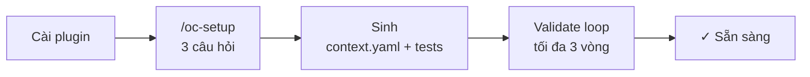
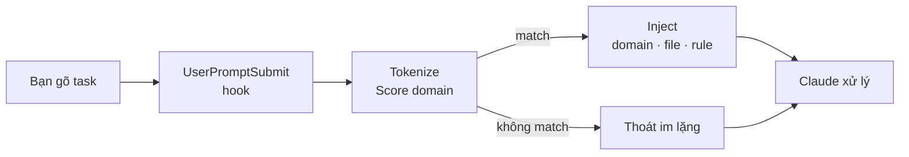

<p align="center">
  
</p>

<p align="center">
  Routing context zero-LLM cho AI agent — hook vào mọi prompt,<br>
  chỉ inject đúng domain, file, và architecture rule liên quan.
</p>

<p align="center">
  <a href="https://github.com/oopsla5xx/open-context/releases"></a>
  <a href="./LICENSE"></a>
  
  
</p>

<p align="center">
  
  
  
  
  
  
</p>

<p align="center">
  Mọi repo, mọi kiến trúc — profile project docs-first, không cần detector riêng cho từng framework.
</p>

<p align="center">
  <strong>Tiếng Việt</strong> · <a href="./README.md">English</a>
</p>

---

AI agent trên codebase lớn thường mặc định load hết — toàn bộ `CLAUDE.md`, docs của mọi domain, model không liên quan. Context window đầy nhanh, độ chính xác giảm. Vấn đề không phải agent chưa đủ thông minh — mà là signal đầu vào quá nhiễu.

Open:Context là Claude Code plugin hook vào mọi prompt qua `UserPromptSubmit`. Nó tokenize task, score theo `context.yaml`, và chỉ inject đúng phần match: component chain, file liên quan, và architecture rule áp dụng. Nếu không có gì match, hook thoát im lặng. Hoàn toàn deterministic — không có LLM nào trong routing path.

---

## Kết quả trông như thế nào

Bạn gõ task. Trước khi Claude xử lý, hook đã resolve và inject xong:

```
[bạn gõ]   implement password reset for patron

[injected]  ────────────────────────────────────────────────────────────
            TASK   : implement password reset for patron
            ACTION : create
            ────────────────────────────────────────────────────────────

            [MATCHED DOMAINS]
              member_management   score=2  keywords=['patron']

            [COMPONENTS]
              ▸ CONTROLLER  — instantiates one Operation, renders via Serializer
              ▸ OPERATION   — step_* structure, Form.valid! trước mọi write
              ▸ FORM        — ApplicationForm, chỉ validate, không side-effect
              ▸ MODEL       — AR persistence
              ▸ SERIALIZER  — JSON trong Controller, không trong Operation

            [RULES]  (4 applicable)
              [CRITICAL] rule-01-no-business-logic-in-controller
              [CRITICAL] rule-02-one-operation-per-action
              [CRITICAL] rule-03-step-method-structure
              [CRITICAL] rule-04-validate-before-mutate

            [FILES]  (3 entries)
              app/controllers/v1/librarians/members_controller.rb
              app/operations/v1/librarians/members/create_operation.rb
              app/models/member.rb
```

Sau mỗi prompt có match, Claude Code hiện một system notice kèm thống kê tiết kiệm token:

```
[open-context] 91% token reduction (1.2 KB injected vs 14.8 KB full context)
```

Task không match domain nào (ví dụ "giải thích lỗi này") → hook thoát im lặng, không inject gì, không hiện notice.

---

## Cài đặt

```bash
/plugin marketplace add oopsla5xx/open-context
/plugin install open-context@open-context
```

**Gỡ cài đặt:**

```bash
/plugin uninstall open-context@open-context
/plugin marketplace remove open-context
```

**Cập nhật lên phiên bản mới nhất:**

```bash
claude plugin update open-context@open-context
```

Chạy lệnh này từ terminal, không phải slash command trong Claude Code — `/plugin update` không tồn tại. Restart Claude Code sau đó để nạp phiên bản mới.

---

## Setup

```bash
/oc-setup
```

Hỏi 3 câu — scope, ngôn ngữ giao tiếp, và một bước confirm project profile duy nhất — rồi sinh `context.yaml` và test phrasing file dưới `.open-context/`, validate trong một agentic loop. Chạy lại bất cứ lúc nào để cấu hình lại.

`.open-context/` **local trên máy bạn và bị gitignore** (wizard tự thêm dòng này) — routing config là của riêng từng developer, không chia sẻ qua git cho cả team. Đồng nghiệp nào muốn dùng routing thì tự chạy `/oc-setup`.

Câu hỏi project profile ưu tiên đọc docs trước: nó đọc `README.md`/`CLAUDE.md`/`AGENTS.md`/`docs/**/*.md` sẵn có trong repo (tìm bằng scan xác định `open-context discover-docs`) để tổng hợp language/framework/architecture/actors, ghi rõ mỗi field lấy từ file nào. Không có docs? Nó fallback sang đọc trực tiếp source code, giống cách một kỹ sư mới đọc code lần đầu — hoạt động với mọi ngôn ngữ/framework, không chỉ những cái có detector sẵn. Stack auto-detect (`open-context detect`) hỗ trợ thêm manifest Ruby/Node/Python/Go/Rust/Java như một lớp cross-check gần như chắc chắn. Chi tiết ở [`docs/reference.md`](docs/reference.md#automated-discovery) *(tiếng Anh)*.

---

## Cách hoạt động

**Lần đầu — setup một lần cho mỗi project:**



**Mọi prompt — routing tự động:**



`context.yaml` được sinh dưới `.open-context/` bởi `/oc-setup` hoặc `/oc-init` — hoặc tự viết tay ở bất cứ đâu hook tìm tới (xem [`examples/`](examples/) cho các project tham khảo đã commit, gồm cả 1 ví dụ hoàn toàn không có architecture layer). PyYAML đã vendor sẵn, không cần `pip install` cho hook. Schema đầy đủ ở [`docs/reference.md`](docs/reference.md#contextyaml) (tiếng Anh).

---

## Skills

| Skill | Làm gì |
|-------|--------|
| `/oc-setup` | Wizard chạy lần đầu — pre-fill câu trả lời từ automated discovery, sinh `context.yaml` + test, validate routing, chạy lại được bất cứ lúc nào |
| `/oc-init` | Sinh lại `context.yaml` từ settings có sẵn + scan docs và source |
| `/oc-resolve <task>` | Debug routing — full resolver output, kể cả domain dưới ngưỡng |
| `/oc-validate` | Phrasing coverage + amplification safety check trên `context.yaml` |

---

## Xem thêm

- [`docs/reference.md`](docs/reference.md) *(tiếng Anh)* — chi tiết automated discovery, schema `context.yaml`, limitations, các caveat chưa được đo
- [`docs/open-context-v0-architecture.md`](docs/open-context-v0-architecture.md) *(tiếng Anh)* — phương pháp benchmark
- [`examples/rails-hmvc-sample/`](examples/rails-hmvc-sample/) — project reference, kiến trúc HMVC theo layer
- [`examples/nextjs-sample/`](examples/nextjs-sample/) — project reference, Next.js Server Actions
- [`examples/data-pipeline-sample/`](examples/data-pipeline-sample/) — project reference **không có** `architecture.flow` — script độc lập, không layer

---

## Giấy phép

Apache 2.0 — xem [LICENSE](LICENSE).
PyYAML (vendor trong `vendor/yaml/`) là MIT — xem [`vendor/PYYAML_LICENSE`](vendor/PYYAML_LICENSE).
